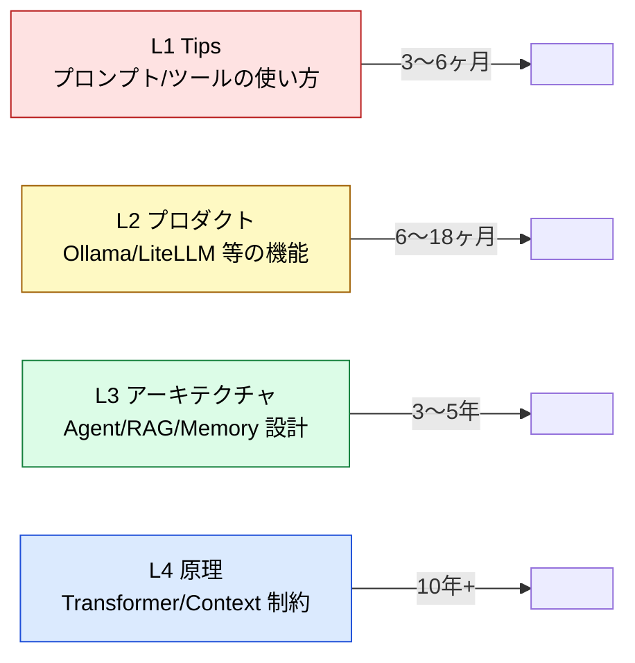
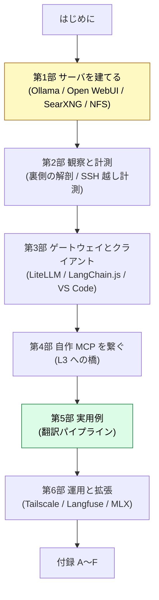

:::message
**この章でできるようになること**: 本書が何を扱い、誰に向けた本で、どう読み進めればよいかを把握できる。
:::

## なぜローカル LLM を「建てる」のか

クラウドの LLM はすでに十分に賢く、API を叩けば動きます。それでも手元の Mac に LLM サーバを建てる狙いは、**インフラ運用の習得そのものではありません**。目的は、**特定のベンダーやツールに依存しない「選定眼」と「設計判断力」を、自分の手で原理から積み上げること**です。

クラウド越しに使っているだけだと、「なぜそのモデルなのか」「なぜそのコンテキスト長なのか」「1回の応答の実コストは何か」が**ブラックボックスのまま**になりがちです。手元で建てると、モデルサイズとメモリの綱引き、コンテキスト窓の予算、tool calling が落ちる境界、後処理で GPU が回り続ける正体——といった**普段は見えない制約**が、すべて自分の計器に映ります。

本書は、その「**原理 → 設計 → 実装**」の循環を、Apple Silicon Mac 1 台の上で閉じるためのハンズオンです。

## 本書の立ち位置（4 レイヤーモデルと半減期）

AI 駆動開発の情報は、**半減期（陳腐化までの寿命）**で 4 つの層に分けられます（出典: [Discussion #80](https://github.com/shuji-bonji/ai-agent-architecture/discussions/80)）。

**本書は L1（Tips）/ L2（プロダクト）** を担います。半減期が短いので、**本書は「書いた時点で封じるスナップショット」**として扱います。半年後に手順の一部が古くなるのは織り込み済みで、本気でメンテし続けることはしません。

これは姉妹リポジトリとの**媒体の使い分け**でもあります。

| レイヤー | 半減期 | リポジトリ | 媒体 |
| --- | --- | --- | --- |
| L1/L2 | 3〜18ヶ月 | 👈 本書 | **Zenn book（封じる）** |
| L3 | 3〜5年 | [ai-agent-architecture](https://github.com/shuji-bonji/ai-agent-architecture) | VitePress（維持する） |
| L4 | 10年+ | [understanding-llm-through-claude-code](https://github.com/shuji-bonji/understanding-llm-through-claude-code) | VitePress（維持する） |

Discussion #80 には「**L3〜L4 だけを読み続けると、目の前のツールで実際に何が起きているかの解像度が落ちる**」という問題意識があります。本書はその逆方向——**具体的なツールを建てて動かすことで原理の解像度を取り戻す**——への解答です。各章末では、その実装判断が L3 のどの設計、L4 のどの構造的制約に接続するかを拾います（付録 B / C に早見表）。

## 対象読者と前提環境

**対象読者**:

- 手元の Mac でローカル LLM を**実際に建てて運用したい**人
- クラウド LLM をブラックボックスのまま使うのではなく、**選定と設計の判断軸を持ちたい**人
- TypeScript / シェル / SSH が読める程度の開発者（深い ML 知識は不要）

**前提環境**:

| 項目 | 想定 |
| --- | --- |
| マシン | Apple Silicon Mac（本書の実機は **M1 Pro / 32GB**。16GB でも軽量モデルなら可） |
| OS | macOS（ターミナル / SSH / Homebrew が使える状態） |
| クライアント | 同一 LAN 上の別 Mac（任意。ヘッドレス運用の章で使用） |
| 方針 | **Docker は使わない**（pip / Homebrew / LaunchDaemon を優先し、VM オーバーヘッドを避ける） |

:::message
本書のサーバ機にはハンズオン上の固有名（ホスト名 `neko8` など）が出てきますが、いずれも**読み替え用の具体例**です。ご自身の環境名に置き換えて読んでください。
:::

## 本書の歩き方

読み進めるための約束ごと:

- **各章の冒頭**に「この章でできるようになること」を 1 行で置きます。
- **各章に前提**（先に終えておくべき章）を明示します。第 1 部が全体の土台です。
- **章の状態**をマークします: ✅ 検証済み / 🟡 実験的に確認 / 🚧 未着手・構想。後半（第 4・6 部）には構想段階の章が含まれます。
- 本文は、別に蓄積している**作業台（private リポジトリ）の手順書から蒸留**しています。失敗や寄り道はそちらに残し、本書には**残った普遍部分だけ**を載せます。

:::message alert
本書（L1/L2）は陳腐化を前提としたスナップショットです。手順やバージョン依存の記述は、**読んでいる時点で古くなっている可能性**があります。古びにくい「判断軸」の部分を主に持ち帰ってください。
:::

それでは、第 1 部でサーバの全体像とメモリ予算から始めます。
